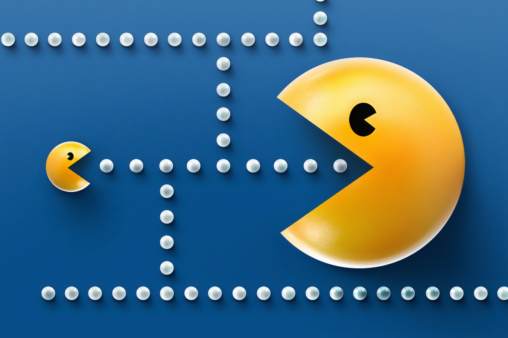

# PacMan Kata



## Pre-requisitos
Para evaluar tu código e identificar posibles mejoras debes instalar y utilizar las siguientes herramientas:

- [Rubocop](https://github.com/bright-coders/commons/tree/master/topics/rubocop)
- [Rubycritic](https://github.com/bright-coders/commons/tree/master/topics/rubycritic)
- [SandiMeter](https://github.com/makaroni4/sandi_meter)

## Requerimientos funcionales

This Kata is obviously inspired by the great game of Pac-Man (Namco 1980), yet the task is not about creating a real-time game. All state changes (moving, eating and so on) will be made in discrete steps (ticks), like in the GameOfLife Kata. We assume that the Pac-Man and ghosts move one field on each tick. The Kata is strictly oriented on improving your OOP skills, it is not about game development. This Kata's task is about good OOP programming and testing, the visualisation is not crucial.

### Problem Description

Pacman finds himself in a grid filled with monsters. Will he be able to eat all the dots on the board before the monsters eat him?

Incomplete list of things the game needs:

- pacman is on a grid filled with dots
- pacman has a direction
- pacman moves on each tick
- user can rotate pacman
- pacman eats dots
- pacman wraps around
- pacman stops on wall
- pacman will not rotate into a wall
- game score: number of dots eaten in this level (optional)
- monsters (optional)
- levels (optional)
- animate pacman eating: mouth opens and closes (optional)

### Clues

You probably won’t be able to complete all of the list in one night of dojo, however having the list (or starting with part of it and letting the participants brainstorm) makes for good design discussions. As in the game of life, a board representation does not have to be difficult. E.g. pacman starts in the centre of the board and is looking up (notice that pacman eats, so the V points downward because pacman has his mouth open):

```
- - - - -
| . . | .
| . V . .
| . . | .
- - . .
```

Pacman looks continuous, however the game state changes in discrete steps. Creating a tick() method/function or somesuch, or passing a board to a function which returns a ‘next state’ board makes it easy to test the various conditions.

Taken from [Coding Dojo](https://codingdojo.org/)

## Requerimientos no-funcionales
- Calidad
  - Utilizar estilo de código definido por la comunidad (apoyarse en Rubocop)
  - Pruebas unitarias
  - Puntuación en Rubycritic: **por lo menos 90** en la carpeta de la App y por lo menos 65 en la carpeta de pruebas
  - Utilizar [SandiMeter](https://github.com/makaroni4/sandi_meter) para analizar el código y utilizar el resultado para hacer mejoras
- Ejecución
  - Puede ejecutarse desde la linea de comandos y mostrar la salida en consola
- Código fuente
  - Orientado a Objetos 
  - Métodos Pequeños
  - [Aplicar los principios SOLID](https://rubygarage.org/blog/solid-principles-of-ood)
- Otros
  - Incluir en el repositorio el [SmallBadge](https://github.com/jorge27/tutorial-rubycritic-small-badge) con la puntuación obtenida por - RubyCritic
  - Incluir en el repositorio el reporte HTML que genera [SandiMeter](https://github.com/makaroni4/sandi_meter)
  - Los commits de Git deben ser atómicos y significativos
  
## Tecnologías
- Lenguaje de programación Ruby
- Framework para pruebas [Rspec](https://rspec.info/) ó [Minitest](https://github.com/seattlerb/minitest)
- Rubocop, RubyCritic y SandiMeter para calidad de código
- Línea de comando

## Entregable
- Código fuente en Github
  
## Enlaces
[Encuentra aquí una lista completa de recursos de ayuda](https://github.com/bright-coders/commons/tree/master/topics/resources)
